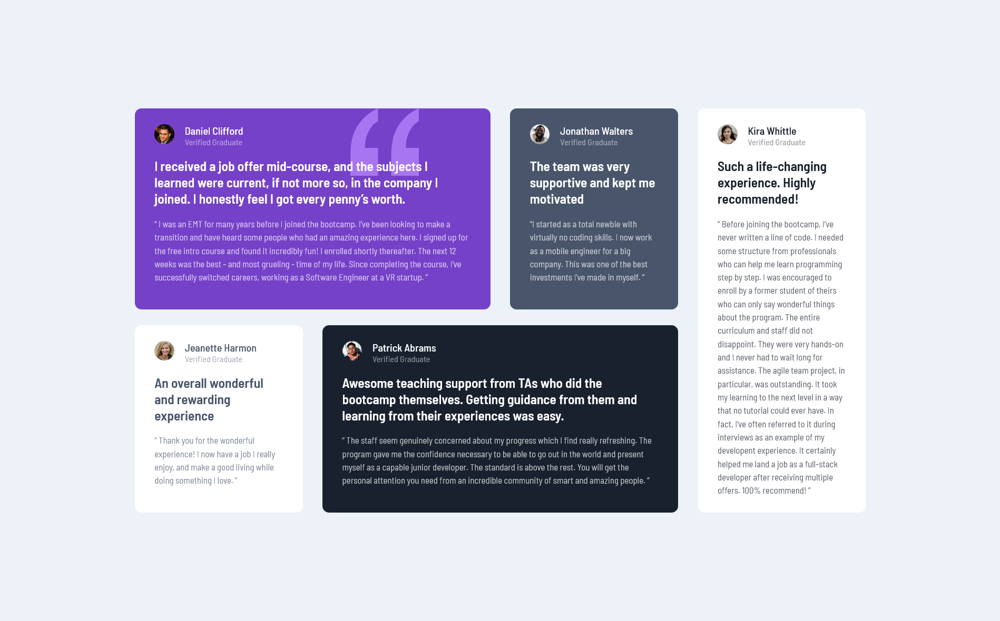

# Frontend Mentor - Testimonials grid section

## Table of contents

- [Overview](#overview)
  - [The challenge](#the-challenge)
  - [Screenshot](#screenshot)
  - [Links](#links)
- [My process](#my-process)
  - [Built with](#built-with)
- [Author](#author)

## Overview

### The challenge

Users should be able to:

- View the optimal layout depending on their device's screen size

### Screenshot

### Links

- Solution URL: [https://github.com/k-hroma/FrontendMentorJunior/tree/main/TestimonialsGrid]
- Live Site URL: [https://k-hroma.github.io/FrontendMentorJunior/TestimonialsGrid/]

## My process

### Built with

- Semantic HTML5 markup
- CSS custom properties
- Flexbox
- CSS Grid
- Mobile-first workflow

## Author

- Website - [Rocío Mendonca](https://www.linkedin.com/in/rocio-mendonca-gainza-/)
- Frontend Mentor - [@k-hroma](https://www.frontendmentor.io/profile/k-hroma)

